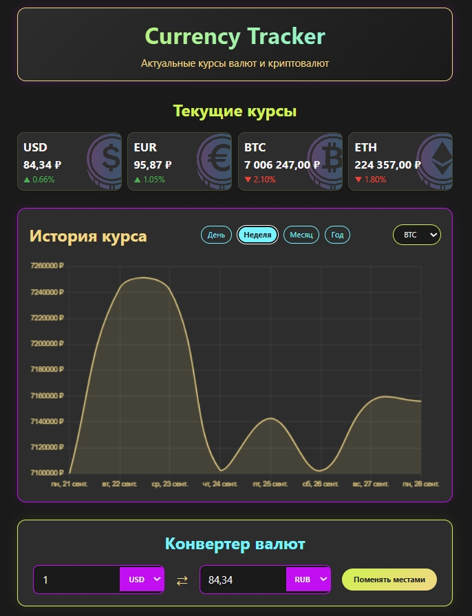

# Currency Tracker 🌐

[](https://larawagner008.github.io/Currency-Tracker/)


Веб-приложение для отслеживания курсов валют с графиками и конвертером. Доступно по ссылке:  
👉 [https://larawagner008.github.io/Currency-Tracker/](https://larawagner008.github.io/Currency-Tracker/)



## ✨ Особенности

- 💵 Актуальные курсы USD, BTC, ETH к рублю
- 📊 Интерактивные графики за день/неделю/месяц/год
- 🔄 Конвертер валют с мгновенным расчетом
- 🌙 Темная тема интерфейса
- ⚡ Автообновление каждую минуту

## 🛠 Технологии


## 📡 Используемые API

- [API Центробанка РФ](https://www.cbr-xml-daily.ru/) - курсы USD, EUR
- [CoinGecko API](https://www.coingecko.com/) - курсы BTC, ETH

## ⚠️ Ограничения

1. **Курс USD**: Временно недоступен из-за ограничений API
2. **Курс EUR**: Временно недоступен из-за ограничений API


## 🚀 Как использовать

1. Откройте [сайт приложения](https://larawagner008.github.io/Currency-Tracker/)
2. Для конвертации:
   - Введите сумму
   - Выберите валюты
   - Результат появится автоматически
3. Для просмотра графика:
   - Выберите валюту
   - Выберите период

## 🛠 Локальная установка

```bash
git clone https://github.com/larawagner008/Currency-Tracker.git
cd Currency-Tracker
```
Просто откройте `index.html` в браузере.